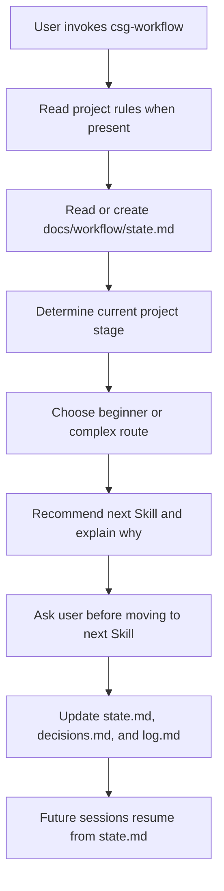
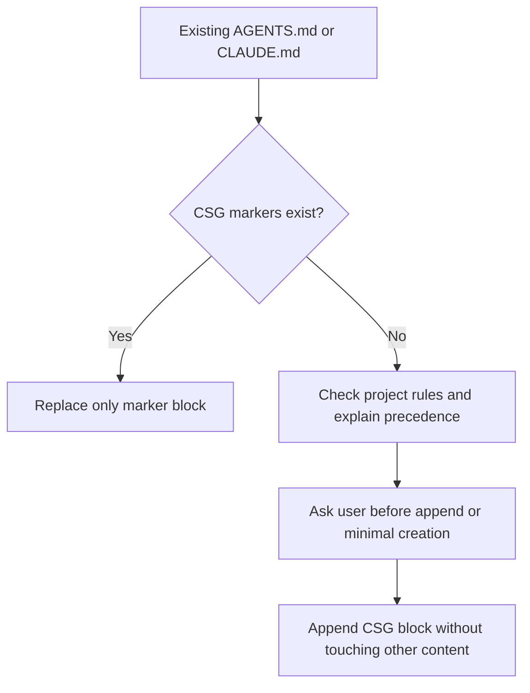
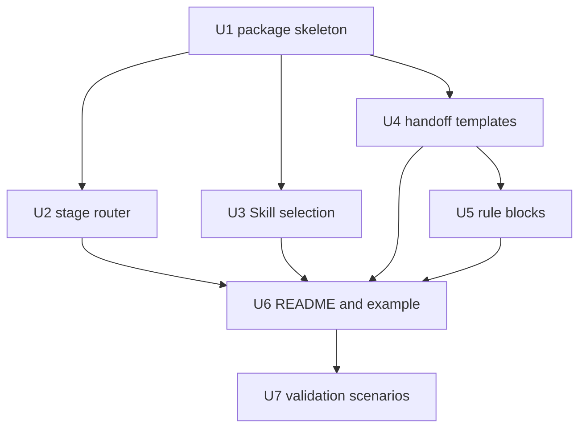
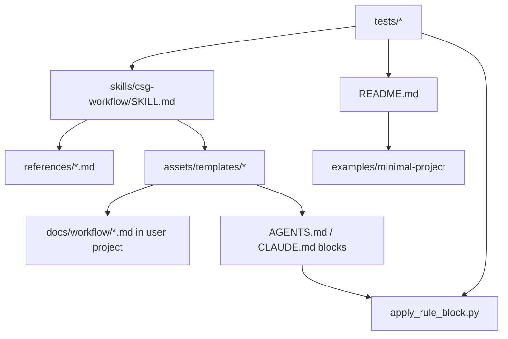

# feat: Build csg-workflow skill V1

## Overview

Build the first open-source-ready `csg-workflow` Skill package. V1 proves the narrow wedge approved in the CEO review: route a user to the right project stage, recommend the next Skill, maintain handoff files, safely add short project-rule blocks, and provide a minimum example that a new user can inspect and run through.

This plan does not build a plugin, UI, full project manager, or automatic end-to-end executor. It creates a portable Skill package plus deterministic validation around the parts most likely to damage user projects: project-rule updates, state file shape, package structure, and README clarity.

---

## Problem Frame

New users can install many AI coding Skills but still struggle to know where a project starts, which Skill belongs to each stage, when a stage is done, and how to continue after compact, clear, or a new session. The origin document defines `csg-workflow` as the thin coordinator across Compound, Superpowers, and Gstack, with Compound as the main route, Superpowers as execution discipline, and Gstack as review, QA, shipping, and recovery support (see origin: `docs/brainstorms/2026-05-06-csg-workflow-requirements.md`).

The CEO review narrowed V1 to one product proof: a stranger can install or inspect the Skill, start from a new or existing project, know the current stage, know the next Skill, preserve handoff state, and resume later without reopening settled decisions (see origin: `docs/reviews/2026-05-06-csg-workflow-ceo-review.md`).

---

## Requirements Trace

- R1. V1 is limited to routing, handoff, templates, and examples.
- R2. V1 works from a new or existing project, recommends the next Skill, and creates or updates handoff files.
- R3. V1 includes a minimum runnable example from empty project to state file to requirements or plan stage.
- R4. V1 separates roadmap recommendations from automated V1 scope.
- R5. V1 includes install, dependencies, compatibility, license, minimum example, and README first-screen explanation.
- R6. The Skill recognizes the full project-stage set.
- R7. The Skill supports beginner-small-project and complex-project routes.
- R8. Each stage names default, optional, and currently discouraged Skills.
- R9. Each recommendation explains why in simple language.
- R10. Each stage has pass criteria and rollback guidance.
- R11. The full route is idea, requirements, plan, plan review, build, code review, QA, PR or delivery, post-release check, and learning.
- R12. The Skill distinguishes Compound, Superpowers, and Gstack roles.
- R13. The Skill resolves duplicate Skill choices by category.
- R14. The Skill groups Skills as required, situational, and complex-project-only.
- R15. The Skill recommends first and waits for user confirmation before moving to another Skill.
- R16. Missing Skills produce a clear fallback path instead of breaking the flow.
- R17. V1 does not auto-install Compound, Superpowers, or Gstack.
- R18. `docs/workflow/state.md` is the recovery entrypoint, not the whole history.
- R19. `state.md` stays short and current.
- R20. Stage completion updates `state.md`; missing or stale state blocks forward progress.
- R21. New sessions read project rules and `state.md` before choosing the next step.
- R22. Long-term decisions go to `docs/workflow/decisions.md`; stage history goes to `docs/workflow/log.md`.
- R23. Each stage requires actual verification records when relevant.
- R24. Completed stages and meaningful errors prompt learning capture, defaulting to `ce-compound`.
- R25. Output stays beginner-friendly, with advanced paths separated.
- R26. Stage reports let later Skills continue without guessing product intent.
- R27. V1 includes light `AGENTS.md` and `CLAUDE.md` templates.
- R28. Rule files contain only short hard rules.
- R29. Rule files do not contain the full workflow or history.
- R30. Existing rule files are never overwritten.
- R31. `csg-workflow` rule blocks have explicit begin and end markers and only replace their own block.
- R32. Existing project rules win on conflict unless the user explicitly says otherwise.
- R33. Missing rule files should first prompt `/init`; minimal file creation requires user confirmation.
- R34. Codex and Claude Code rule blocks are separate, even when similar.

**Origin actors:** A1 new user, A2 experienced user, A3 `csg-workflow` Skill, A4 orchestrated Skills, A5 future-session AI, A6 project rule files.

**Origin flows:** F1 new project start, F2 stage progression, F3 context recovery, F4 route depth selection, F5 learning capture.

**Origin acceptance examples:** AE1 fuzzy idea routing, AE2 no-validation stage block, AE3 review Skill choice, AE4 new-session recovery, AE5 small-script route, AE6 learning capture, AE7 existing rule-file safety, AE8 missing rule-file behavior, AE9 missing Gstack fallback, AE10 README first screen.

---

## Scope Boundaries

### Deferred for later

- Automatic scanning of all locally installed Skills and dynamic capability graph generation.
- Visual project-stage dashboard.
- Automatic stale-state detection and proactive reminders.
- Automatic GitHub PR creation, Notion sync, Linear sync, or Slack sync.
- Multi-project management and shared team state.
- Upgrading the workflow into a plugin.
- Complete tutorials or case libraries for every downstream Skill.
- Automatic installation of Compound, Superpowers, or Gstack.

### Outside this product's identity

- Do not replace Compound, Superpowers, or Gstack.
- Do not reimplement existing Skills.
- Do not force every project into one heavy process.
- Do not become a project-management tool or task board.
- Do not become a complex methodology paper for advanced users only.
- Do not turn `AGENTS.md` or `CLAUDE.md` into large manuals.
- Do not take ownership of user project rules.
- Do not automatically rewrite rule files created by `/init`.

### Deferred to Follow-Up Work

- Publish automation for package release after V1 content and validation pass.
- Full English documentation parity after the Chinese V1 proves the workflow.
- Real multi-agent pressure testing as a release hardening pass when an isolated validation setup is available.

---

## Context & Research

### Relevant Code and Patterns

- Current repo is documentation-first and has no existing implementation directory. V1 should introduce a clear `skills/csg-workflow/` package instead of mixing Skill runtime content into `docs/`.
- Existing generated docs already define the product intent, route, state model, and rule-block policy: `docs/brainstorms/2026-05-06-csg-workflow-requirements.md`, `docs/reviews/2026-05-06-csg-workflow-ceo-review.md`, and `docs/office-hours/2026-05-06-csg-workflow-open-source-review.md`.
- Existing rule templates in `docs/workflow/templates/` should be treated as design input, then turned into packaged assets under the Skill directory.
- Local Skill authoring patterns favor one required `SKILL.md`, optional `agents/openai.yaml`, and optional `references/`, `assets/`, and `scripts/` resources. Heavy tables and templates should live outside `SKILL.md` and be loaded only when needed.
- Existing Compound Skills use `references/` for longer workflow details; this plan follows that pattern so `SKILL.md` remains a thin router.

### Institutional Learnings

- No `docs/solutions/` directory exists in this repo yet, so there are no prior local learnings to carry forward.
- The current workflow state explicitly says not to reopen the plugin-vs-Skill decision, the CSG role split, or the rule-file conflict policy.

### External References

- No web research is required for V1. The work depends on local Skill packaging conventions and the existing product documents, not a changing external API.

---

## Key Technical Decisions

- **Create a repo-local Skill package at `skills/csg-workflow/`:** This keeps design docs separate from installable Skill content and gives open-source users an obvious package root.
- **Keep `SKILL.md` as the router, not the manual:** Stage details, Skill selection tables, state-file rules, missing-Skill fallbacks, and project-rule behavior move into direct `references/` files.
- **Use deterministic scripts only for fragile file operations:** Rule-block insertion and package validation should be script-backed because accidental overwrite is the highest-risk V1 behavior.
- **Use assets for templates:** `state.md`, `decisions.md`, `log.md`, `AGENTS.md` block, and `CLAUDE.md` block should be copied from `assets/templates/` rather than rewritten from memory each run.
- **Use README as the public landing surface:** The root README should explain CSG, audience, V1 boundary, install path, minimum example, compatibility, and missing-Skill behavior before deep details.
- **Default license assumption is MIT:** This matches the intended open-source distribution and can be changed before release if the owner chooses a different license.
- **Do not detect or install external Skills automatically:** V1 should explain missing dependencies and continue with manual alternatives.

---

## Open Questions

### Resolved During Planning

- `state.md`, `decisions.md`, and `log.md` fields: resolve as short templates under `skills/csg-workflow/assets/templates/workflow/`, with update rules in `references/handoff-state.md`.
- Skill selection rules location: keep the essentials in `SKILL.md`, and move tables to `references/stage-router.md`, `references/skill-selection.md`, and `references/missing-skills.md`.
- User confirmation before next Skill: document this as a hard rule in `SKILL.md`; the Skill recommends the next Skill and asks before routing.
- Rule block templates: package Codex and Claude Code blocks as separate assets and support safe marker replacement.
- Chinese vs English: write V1 primary docs in Chinese, but make README first screen clear enough for later English parity.

### Deferred to Implementation

- Exact prose of Skill prompts and route explanations: finalize while writing the Skill, then validate against the pressure scenarios.
- Exact install command examples: choose the final wording after the package folder and README structure exist.
- Whether `agents/openai.yaml` is generated by script or written directly: decide during implementation based on available tooling, but the file must match `SKILL.md`.

---

## Output Structure

```text
skills/csg-workflow/
  SKILL.md
  agents/
    openai.yaml
  references/
    stage-router.md
    skill-selection.md
    handoff-state.md
    project-rules.md
    missing-skills.md
  assets/
    templates/
      AGENTS.md.block
      CLAUDE.md.block
      workflow/
        state.md
        decisions.md
        log.md
  scripts/
    apply_rule_block.py
    validate_package.py
examples/
  minimal-project/
    README.md
    docs/
      workflow/
        state.md
        decisions.md
        log.md
tests/
  fixtures/
    rules/
      existing_agents.md
      existing_claude.md
      missing_rules_empty_project/
  pressure-scenarios/
    csg-workflow-v1.md
  test_csg_workflow_package.py
LICENSE
README.md
```

---

## High-Level Technical Design

> *This illustrates the intended approach and is directional guidance for review, not implementation specification. The implementing agent should treat it as context, not code to reproduce.*



Rule-file updates follow a separate safety path:



---

## Implementation Units



- U1. **Create the Skill package skeleton**

**Goal:** Establish the installable package layout, metadata, and validation harness for V1.

**Requirements:** R1, R5, R25

**Dependencies:** None

**Files:**
- Create: `skills/csg-workflow/SKILL.md`
- Create: `skills/csg-workflow/agents/openai.yaml`
- Create: `skills/csg-workflow/scripts/validate_package.py`
- Create: `tests/test_csg_workflow_package.py`

**Approach:**
- Make `SKILL.md` a concise router with frontmatter that triggers on project workflow routing, stage handoff, new-session recovery, or confusion about Compound, Superpowers, and Gstack.
- Add `agents/openai.yaml` so the Skill has user-facing metadata in Codex-style skill lists.
- Add package validation with check groups. U1 should enforce the skeleton contract; later units add README, example, and rule-helper checks when those files exist.

**Execution note:** Build validation early so later units can add content against a fixed package contract.

**Patterns to follow:**
- Local Skill package pattern: `SKILL.md` plus optional `agents/`, `references/`, `assets/`, and `scripts/`.
- Current repo convention: durable planning and requirements artifacts live under `docs/`.

**Test scenarios:**
- Happy path: given a complete V1 skeleton, package validation passes the skeleton check group and reports later check groups as not yet applicable.
- Error path: given a `SKILL.md` missing `name` or `description`, validation fails with the missing field named.
- Error path: given any packaged markdown file containing an absolute local path, validation fails and names the file.
- Error path: given a packaged markdown file containing unfinished draft markers or absolute local paths, validation fails and names the file.

**Verification:**
- The package folder exists, can be validated without relying on chat history, and exposes a clear V1 trigger and package contract.

---

- U2. **Build the stage router**

**Goal:** Define how `csg-workflow` determines the current stage, selects beginner vs complex route depth, applies pass criteria, and avoids moving forward when verification is missing.

**Requirements:** R2, R6, R7, R8, R9, R10, R11, R15, R23, R25, F1, F2, F4, AE1, AE2, AE5

**Dependencies:** U1

**Files:**
- Modify: `skills/csg-workflow/SKILL.md`
- Create: `skills/csg-workflow/references/stage-router.md`
- Create: `tests/pressure-scenarios/csg-workflow-v1.md`
- Modify: `tests/test_csg_workflow_package.py`

**Approach:**
- Keep the stage list and short default route in `SKILL.md`; put detailed stage table, pass criteria, rollback guidance, and small-vs-complex route differences in `references/stage-router.md`.
- Treat state-file freshness as a gate. If `state.md` is missing or stale, the Skill should stop and repair handoff state before recommending a later stage.
- Make "recommend, then ask" the default behavior. The Skill should not silently jump into another Skill.

**Patterns to follow:**
- Origin Visual Overview flow: read rules, read state, determine stage, recommend Skill, verify, update state.
- Existing Compound planning workflow style: stage gates with explicit handoff to the next Skill.

**Test scenarios:**
- Covers AE1. Happy path: input is a fuzzy project idea with no requirements doc -> stage router classifies idea or requirements stage and recommends `ce-ideate` or `ce-brainstorm`, not coding.
- Covers AE2. Error path: input says "code is done" but has no verification record -> router refuses delivery and asks for verification before moving forward.
- Covers AE5. Happy path: input describes a tiny personal script -> router chooses the beginner-small-project route and omits heavy release-stage recommendations.
- Edge case: state file exists but `下一步` is empty -> router treats state as incomplete and repairs state before continuing.

**Verification:**
- Every project stage has a default next action, pass criteria, rollback guidance, and a plain-language explanation.

---

- U3. **Define Skill selection and missing-Skill fallback**

**Goal:** Make CSG role boundaries and duplicate Skill choices explicit, including what to do when Compound, Superpowers, or Gstack is unavailable.

**Requirements:** R8, R12, R13, R14, R15, R16, R17, F2, AE3, AE9

**Dependencies:** U1

**Files:**
- Modify: `skills/csg-workflow/SKILL.md`
- Create: `skills/csg-workflow/references/skill-selection.md`
- Create: `skills/csg-workflow/references/missing-skills.md`
- Modify: `tests/pressure-scenarios/csg-workflow-v1.md`
- Modify: `tests/test_csg_workflow_package.py`

**Approach:**
- Put the short CSG role split in `SKILL.md`: Compound is the main route, Superpowers is work discipline, Gstack is review, QA, ship, recovery, and retrospective support.
- Put duplicate-choice tables in `references/skill-selection.md` by category: ideation, requirements, planning, code work, code review, QA, shipping, recovery, learning.
- Put dependency and fallback guidance in `references/missing-skills.md`, including manual fallback steps and a strict no-auto-install rule.

**Patterns to follow:**
- CEO review mitigation for missing plugins: explain what is missing, give a manual alternative, and continue when possible.
- Origin requirement to classify Skills as required, situational, and complex-project-only.

**Test scenarios:**
- Covers AE3. Happy path: user asks which review Skill to use -> selection table recommends `ce-code-review` first, Gstack review near merge or release, and Superpowers for review discipline.
- Covers AE9. Error path: Gstack is missing but Compound exists -> workflow continues with Compound route and marks Gstack QA or ship steps as install-dependent recommendations.
- Edge case: a Skill name is unknown or unavailable -> fallback guidance avoids pretending it was invoked and gives a manual next step.
- Integration: route output includes both next Skill and why the Skill fits the current stage.

**Verification:**
- Duplicate Skill categories have one default, optional alternatives, and a missing-Skill fallback.

---

- U4. **Package handoff state templates and update rules**

**Goal:** Provide the state, decisions, and log templates that let future sessions resume without redoing product decisions.

**Requirements:** R2, R18, R19, R20, R21, R22, R23, R24, R26, F3, F5, AE4, AE6

**Dependencies:** U1, U2

**Files:**
- Create: `skills/csg-workflow/references/handoff-state.md`
- Create: `skills/csg-workflow/assets/templates/workflow/state.md`
- Create: `skills/csg-workflow/assets/templates/workflow/decisions.md`
- Create: `skills/csg-workflow/assets/templates/workflow/log.md`
- Modify: `tests/test_csg_workflow_package.py`

**Approach:**
- Define `state.md` as a short current-status panel with fields for current stage, project goal, active docs, next action, blockers, last verification, and do-not-reopen decisions.
- Define `decisions.md` as durable decisions with date, decision, rationale, and source.
- Define `log.md` as append-only stage events with date, stage, result, verification, and next step.
- Document when each file must be created or updated, and when a stale or missing file blocks stage progression.

**Patterns to follow:**
- Current design in `docs/workflow/state.md`, `docs/workflow/decisions.md`, and `docs/workflow/log.md`.
- Open-source review guidance that `state.md` answers "how to continue now" and never becomes a full history.

**Test scenarios:**
- Covers AE4. Happy path: after a new session, the Skill reads project rules and `docs/workflow/state.md`, then continues from the recorded next action.
- Covers AE6. Happy path: after a stage ends with a useful lesson, the Skill recommends `ce-compound` and records the learning pointer in `log.md` or `state.md`.
- Edge case: `state.md` grows past the documented field set -> validation warns that historical detail belongs in `decisions.md` or `log.md`.
- Error path: `state.md` is missing in an existing project -> Skill creates or asks to create the template before recommending a later project stage.

**Verification:**
- Templates are short, field names are stable, and update rules make it clear what belongs in each file.

---

- U5. **Implement safe project-rule block handling**

**Goal:** Provide Codex and Claude Code rule blocks plus a safe helper for appending or replacing only the `csg-workflow` managed block.

**Requirements:** R27, R28, R29, R30, R31, R32, R33, R34, A6, AE7, AE8

**Dependencies:** U1, U4

**Files:**
- Create: `skills/csg-workflow/references/project-rules.md`
- Create: `skills/csg-workflow/assets/templates/AGENTS.md.block`
- Create: `skills/csg-workflow/assets/templates/CLAUDE.md.block`
- Create: `skills/csg-workflow/scripts/apply_rule_block.py`
- Create: `tests/fixtures/rules/existing_agents.md`
- Create: `tests/fixtures/rules/existing_claude.md`
- Create: `tests/fixtures/rules/missing_rules_empty_project/`
- Modify: `tests/test_csg_workflow_package.py`

**Approach:**
- Store Codex and Claude Code blocks separately even if most lines match.
- Implement marker replacement with explicit begin and end tags. The helper should default to preview mode and require an explicit write mode. When markers exist, replace only that section. When markers are absent, append only after user confirmation. When the target file is missing, recommend `/init` first and create a minimal file only after confirmation.
- Document conflict precedence: existing project rules win unless the user explicitly asks to change them.

**Patterns to follow:**
- Existing templates in `docs/workflow/templates/AGENTS.md.template` and `docs/workflow/templates/CLAUDE.md.template`.
- CEO review failure-mode mitigation: never overwrite user rule files.

**Test scenarios:**
- Covers AE7. Happy path: an existing `AGENTS.md` with user rules and an old CSG block -> helper replaces only the marked CSG block and preserves all user content.
- Covers AE7. Edge case: an existing rule file has no CSG block -> helper appends the block without modifying existing rules.
- Covers AE8. Error path: no `AGENTS.md` exists -> workflow recommends `/init` first and does not silently create a long rules file.
- Error path: helper runs without explicit write mode -> it previews the change and leaves the file unchanged.
- Error path: file contains begin marker without end marker -> helper refuses to edit and tells the user manual repair is needed.
- Integration: Codex block and Claude Code block each name the matching rule file and do not assume one tool reads the other's file.

**Verification:**
- Rule-block tests prove that existing content survives unchanged outside the managed markers.

---

- U6. **Write the public README, license, and minimum example**

**Goal:** Make the repository understandable and tryable by a new user without reading the whole design history.

**Requirements:** R3, R5, R25, R26, AE10

**Dependencies:** U2, U3, U4, U5

**Files:**
- Modify: `README.md`
- Create: `LICENSE`
- Create: `examples/minimal-project/README.md`
- Create: `examples/minimal-project/docs/workflow/state.md`
- Create: `examples/minimal-project/docs/workflow/decisions.md`
- Create: `examples/minimal-project/docs/workflow/log.md`
- Modify: `tests/test_csg_workflow_package.py`

**Approach:**
- Rewrite the README first screen around five points: what CSG means, who this helps, what V1 does, what V1 does not do, and how to try the minimum example.
- Include install guidance that describes copying or installing `skills/csg-workflow/` into the user's Skill directory, without pretending external plugins are auto-installed.
- Add compatibility notes for Codex and Claude Code, including `AGENTS.md` and `CLAUDE.md` differences.
- Add `LICENSE` using the MIT default unless changed before implementation.
- Build the minimum example from an empty-project story: no state -> create state -> route to requirements or plan.

**Patterns to follow:**
- CEO review requirement that README first screen explains CSG and V1 boundary.
- Open-source review requirement that a stranger can understand this in about three minutes.

**Test scenarios:**
- Covers AE10. Happy path: README contains CSG meaning, target user, install path, dependency explanation, minimum example, and V1 boundary.
- Happy path: minimum example includes state, decisions, and log files with content matching the packaged templates.
- Error path: README claims automatic plugin installation -> validation flags it as outside V1 scope.
- Edge case: example docs drift from templates -> validation reports the drift or requires an intentional update note.

**Verification:**
- A new reader can start from `README.md`, find the Skill package, inspect the minimum example, and understand the missing-Skill behavior.

---

- U7. **Add V1 pressure scenarios and final validation**

**Goal:** Verify the Skill package against the acceptance examples before calling V1 implementation-ready.

**Requirements:** R1 through R34, F1 through F5, AE1 through AE10

**Dependencies:** U1, U2, U3, U4, U5, U6

**Files:**
- Modify: `tests/pressure-scenarios/csg-workflow-v1.md`
- Modify: `tests/test_csg_workflow_package.py`
- Modify: `skills/csg-workflow/SKILL.md`
- Modify: `skills/csg-workflow/references/stage-router.md`
- Modify: `skills/csg-workflow/references/skill-selection.md`
- Modify: `skills/csg-workflow/references/handoff-state.md`
- Modify: `skills/csg-workflow/references/project-rules.md`
- Modify: `skills/csg-workflow/references/missing-skills.md`

**Approach:**
- Convert AE1-AE10 into pressure scenarios with inputs, expected route, expected user-facing output shape, and files expected to change or remain untouched.
- Add validation coverage for structural requirements that can be checked deterministically.
- Manually review the scenarios against `SKILL.md` and reference files. If agent-based pressure testing is available later, these scenarios are the source prompts.

**Patterns to follow:**
- Skill-writing guidance: validate process documentation with realistic scenarios, not only static file checks.
- Origin acceptance examples as the source of truth for scenario selection.

**Test scenarios:**
- Happy path: all package validation checks pass for the final Skill package.
- Integration: every AE has at least one pressure scenario and every pressure scenario maps to a Skill behavior or file safety rule.
- Error path: a reference file removes missing-Skill fallback guidance -> validation catches missing coverage for AE9.
- Error path: rule-block helper behavior diverges from documented project-rule policy -> test fixtures fail.

**Verification:**
- V1 is implementation-ready when package validation passes, pressure scenarios cover all acceptance examples, and no plan-scoped requirement is left unaddressed.

---

## System-Wide Impact

- **Interaction graph:** The main surfaces are `SKILL.md`, reference files, workflow templates, rule-block helper script, README, examples, and tests. The Skill must read or create project state before recommending later workflow stages.
- **Error propagation:** Missing Skills, missing state files, stale state, and malformed rule markers should stop forward routing with a clear next action instead of silently continuing.
- **State lifecycle risks:** `state.md` can grow into a history dump; the plan mitigates this with template fields, update rules, and validation warnings.
- **API surface parity:** Codex and Claude Code rule blocks must remain separate and tool-specific, even when they share wording.
- **Integration coverage:** Rule-file fixture tests and acceptance pressure scenarios are the key cross-surface coverage; simple markdown checks alone are not enough.
- **Unchanged invariants:** V1 does not install external plugins, overwrite user rules, auto-run all downstream Skills, or automate QA, ship, deployment, or canary steps.



---

## Risks & Dependencies

| Risk | Mitigation |
|------|------------|
| V1 becomes another long manual | Keep `SKILL.md` short and move details into targeted references. |
| Rule helper damages user files | Test marker replacement with existing-rule fixtures and refuse malformed markers. |
| README overpromises full automation | Validate README for V1 boundary and no auto-install claims. |
| Missing Gstack or Superpowers blocks user progress | Document missing-Skill fallbacks and keep Compound route usable where possible. |
| State file becomes too long | Template only current state; decisions and history go to separate files. |
| Tests only check file presence, not workflow quality | Add pressure scenarios mapped to AE1-AE10. |
| License choice is wrong for release owner | Use MIT as default planning assumption and keep it easy to change before release. |

---

## Alternative Approaches Considered

- **Single huge `SKILL.md`:** Rejected because it would waste context and make the Skill harder to use in every invocation.
- **Docs-only release without scripts:** Rejected because rule-file updates are fragile enough to justify deterministic helper behavior.
- **Plugin-first release:** Rejected by the CEO review because it is too heavy before the workflow proves real usage.
- **Only update `docs/workflow/state.md`:** Rejected because it does not produce an installable open-source Skill.

---

## Success Metrics

- A user can inspect `README.md` and understand CSG, target audience, install path, V1 boundary, and minimum example without reading prior design docs.
- The package validator passes on `skills/csg-workflow/`.
- The rule-block helper preserves existing content outside managed markers.
- Every origin acceptance example AE1-AE10 has a matching pressure scenario.
- No V1 file claims full automation, plugin behavior, or automatic dependency installation.

---

## Documentation / Operational Notes

- Keep design history under `docs/`; keep installable Skill content under `skills/csg-workflow/`.
- The minimum example should stay small and boring; its job is to prove recovery and routing, not demonstrate every downstream Skill.
- Future release notes should be added only after V1 exists. Do not add changelog-style documents in this implementation plan.

---

## Sources & References

- **Origin document:** `docs/brainstorms/2026-05-06-csg-workflow-requirements.md`
- **CEO review:** `docs/reviews/2026-05-06-csg-workflow-ceo-review.md`
- **Open-source review:** `docs/office-hours/2026-05-06-csg-workflow-open-source-review.md`
- **Current workflow state:** `docs/workflow/state.md`
- **Rule templates:** `docs/workflow/templates/AGENTS.md.template`, `docs/workflow/templates/CLAUDE.md.template`
