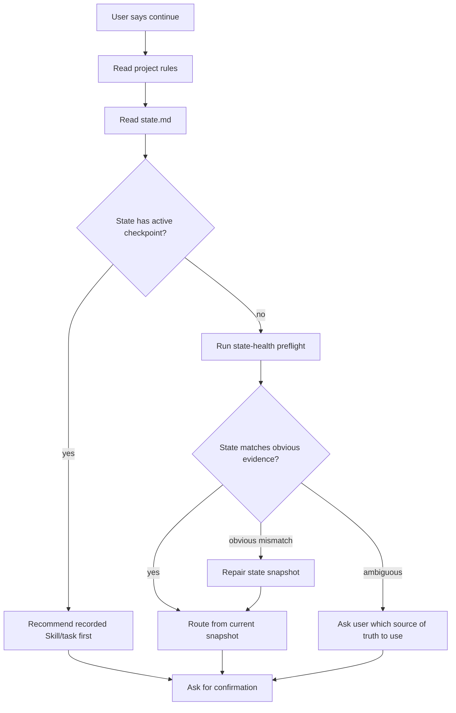

# feat: Add state health recovery

## Overview

Add a lightweight state-health layer to `csg-workflow` so `docs/workflow/state.md` works as a reliable recovery snapshot instead of a stale mini-history. The current branch already adds recovery-only routing and an in-progress checkpoint. This plan completes the loop by adding recovery preflight checks, a completed-task idle snapshot, and pressure scenarios for stale or overgrown state.

---

## Problem Frame

`csg-workflow` promises that a user can continue after compact, clear, or a new session by reading project rules and `docs/workflow/state.md`. The current branch improves this by adding an in-progress checkpoint before long work starts. That protects mid-task recovery, but it does not solve stale state: `state.md` can still claim an old stage, old test count, old next action, or long history after the actual project has moved on.

From the user's perspective, a recovery file is only useful if it answers "what should happen now?" without forcing them to audit the repository. `state.md` should therefore be treated as a current snapshot and verified before routing, not as the sole source of truth.

---

## Requirements Trace

- R1. Recovery must treat `state.md` as a current snapshot, not as the only source of truth.
- R2. On compact, clear, or new session, the agent must run a state-health preflight before trusting `state.md` for routing.
- R3. If `state.md` conflicts with obvious project evidence, the agent must repair `state.md` before recommending the next Skill.
- R4. When a confirmed Skill or long-running task starts, `state.md` must contain an in-progress checkpoint.
- R5. When a task or stage completes, `state.md` must be collapsed to a short idle or next-action snapshot.
- R6. Full stage history must remain in `docs/workflow/log.md`; durable decisions must remain in `docs/workflow/decisions.md`.
- R7. Recovery output must stay user-facing: one current stage, one exact next Skill, one reason, and one confirmation question.
- R8. Validation must fail if templates or pressure scenarios no longer cover stale-state, in-progress, and completed-task recovery.
- R9. The main `skills/csg-workflow/SKILL.md` entry must carry the same state-health recovery contract as the generated rule blocks.
- R10. `state.md` must fit on one quick scan: target 40 lines or fewer, hard limit 60 lines for templates, examples, and this repository's live state.
- R11. Recovery behavior must be verified with at least one realistic read-only trial, not only structural text assertions.

**Origin actors:** A1 new user, A2 experienced user, A3 `csg-workflow` Skill, A5 later-session AI, A6 project rules files.
**Origin flows:** F2 stage advancement, F3 context recovery, F5 learning capture.
**Origin acceptance examples:** AE2, AE4, AE6, AE7.

---

## Scope Boundaries

- Do not create a plugin, dashboard, or background watcher.
- Do not auto-scan every possible project artifact.
- Do not turn `state.md` into a task database or full project log.
- Do not add external dependencies.
- Do not change how Compound, Superpowers, or Gstack Skills execute.

### Deferred to Follow-Up Work

- Optional scripted state doctor that rewrites `state.md` from structured inputs.
- Multi-project state management.
- UI or plugin packaging for state health.

---

## Context & Research

### Relevant Code and Patterns

- `skills/csg-workflow/references/handoff-state.md` already defines file roles, update rules, stale signals, and the new in-progress checkpoint.
- `skills/csg-workflow/SKILL.md` is the explicit Skill entry point. If it does not mention state-health recovery, users who call `$csg-workflow` directly can bypass the stronger rule-block wording.
- `skills/csg-workflow/assets/templates/workflow/state.md` and `examples/minimal-project/docs/workflow/state.md` now include `## 执行中检查点`.
- `skills/csg-workflow/assets/templates/AGENTS.md.block` and `skills/csg-workflow/assets/templates/CLAUDE.md.block` now force recovery-only routing and in-progress checkpoint writes.
- `tests/pressure-scenarios/csg-workflow-v1.md` now covers post-compact recovery and in-progress compact recovery.
- `tests/test_csg_workflow_package.py` already verifies the new recovery rules structurally.
- `docs/workflow/state.md` in this repository is a useful negative example: it contains valuable history, but it is too long to behave like a clean current snapshot.

### Institutional Learnings

- No `docs/solutions/` learning was found for this repository. The plan relies on local requirements, current branch diff, and pressure-test behavior.

### External References

- None used. Local workflow behavior is the authoritative source for this plan.

---

## Key Technical Decisions

- **State-health preflight before routing:** Recovery should read `state.md`, then compare it to obvious project evidence before recommending a Skill. This prevents stale state from being treated as truth.
- **Evidence checks stay lightweight:** The preflight checks only high-signal evidence: required files named by state, current in-progress checkpoint, recent plans or pressure scenarios, and verification claims that are easy to spot. It is not a full audit.
- **Repair before route, but only when evidence is obvious:** If state is stale and the project evidence is clear, the agent summarizes the mismatch, repairs the snapshot, then routes. If evidence is ambiguous, it stops and asks which source of truth to use.
- **Main entry and rule blocks must agree:** `SKILL.md`, `AGENTS.md.block`, `CLAUDE.md.block`, and `handoff-state.md` need the same recovery contract so direct Skill invocation and post-compact project-rule recovery behave the same way.
- **Completed tasks collapse to idle:** After a stage is complete, `state.md` should become a compact "done, waiting for next task" card, not a long summary.
- **History moves out:** `log.md` owns stage history; `decisions.md` owns durable decisions. `state.md` owns only "how to resume now."
- **State size is a product constraint:** A recovery snapshot that takes more than one screen to scan is already failing its job. Keep `state.md` at 40 lines or fewer when possible and fail checks above 60 lines.

---

## Open Questions

### Resolved During Planning

- Should `state.md` be cleared after a task completes? No. It should be collapsed to a short idle snapshot so later sessions know what just finished and what is safe to ignore.
- Should stale state repair run every time? Run the preflight every time. Repair automatically only when the mismatch is obvious; ask the user when the evidence conflicts or is incomplete.

### Deferred to Implementation

- Exact wording of the idle snapshot template can be tuned during implementation after seeing how it reads in the minimal example.
- Whether to add a helper script is deferred; this plan starts with prompt rules, templates, and tests only.

---

## High-Level Technical Design

> *This illustrates the intended approach and is directional guidance for review, not implementation specification. The implementing agent should treat it as context, not code to reproduce.*

---

## Implementation Units

- U1. **Define state-health preflight rules**

**Goal:** Teach `csg-workflow` how to detect stale `state.md` before routing.

**Requirements:** R1, R2, R3, R7

**Dependencies:** None

**Files:**
- Modify: `skills/csg-workflow/SKILL.md`
- Modify: `skills/csg-workflow/references/handoff-state.md`
- Modify: `skills/csg-workflow/assets/templates/AGENTS.md.block`
- Modify: `skills/csg-workflow/assets/templates/CLAUDE.md.block`
- Test: `tests/test_csg_workflow_package.py`

**Approach:**
- Add a "State Health Preflight" section to `handoff-state.md`.
- Define high-signal checks:
  - current stage is present and short
  - next action is present and names an exact Skill when applicable
  - in-progress checkpoint is either idle or points to a concrete Skill/task
  - current documents listed by state exist, when they are repo files
  - recent verification claims are not contradicted by known pressure scenarios or validation notes
  - state stays within the `state.md` scan limit and does not contain long history that belongs in `log.md`
- Update `SKILL.md` and both rule blocks to say recovery first validates `state.md` freshness before routing.
- Keep the output user-facing: if stale and obvious, say what was stale and that the agent repaired the snapshot before routing.
- If stale evidence is ambiguous, ask the user which source to trust instead of silently rewriting `state.md`.

**Patterns to follow:**
- Existing "Staleness Signals" and "Update Rules" in `skills/csg-workflow/references/handoff-state.md`.
- Existing rule-block style in `skills/csg-workflow/assets/templates/AGENTS.md.block`.

**Test scenarios:**
- Happy path: state has idle checkpoint, valid next action, and no stale signals -> route normally.
- Stale next action: state says "plan next" but a completed plan is already recorded -> repair state before routing.
- Missing file: state lists a current document that does not exist -> mark state stale and repair or ask for missing context.
- Overgrown state: state contains long historical sections -> flag as stale and move summary guidance to `log.md`.

**Verification:**
- `SKILL.md` mentions state-health preflight and obvious-vs-ambiguous repair behavior.
- Rule blocks mention state-health preflight.
- `handoff-state.md` defines stale-state repair before routing.
- Tests assert the new required terms and stale-state pressure scenario exist.

---

- U2. **Add completed-task idle snapshot shape**

**Goal:** Define what `state.md` should look like after a task or stage is done.

**Requirements:** R1, R5, R6, R7

**Dependencies:** U1

**Files:**
- Modify: `skills/csg-workflow/references/handoff-state.md`
- Modify: `skills/csg-workflow/assets/templates/workflow/state.md`
- Modify: `examples/minimal-project/docs/workflow/state.md`
- Test: `tests/test_csg_workflow_package.py`

**Approach:**
- Add a "Completed Task Snapshot" section to `handoff-state.md`.
- Define the completed shape as:
  - current stage: idle or next stage
  - last completed task: one sentence
  - result: one sentence
  - recent verification: exact, short
  - next action: waiting for new request or one exact recommended Skill
  - in-progress checkpoint: idle
- Define the completed shape as short enough to stay inside the 40-line target and 60-line hard limit.
- Update state templates with a small `## 上一个任务` or equivalent completion field only if it remains short and useful.
- Avoid copying full stage summaries into `state.md`.

**Patterns to follow:**
- Current `## 执行中检查点` template.
- Existing separation of `state.md`, `decisions.md`, and `log.md`.

**Test scenarios:**
- Task complete: in-progress checkpoint is cleared to idle and last completed task is short.
- Verification preserved: recent verification names the last meaningful check without a long transcript.
- History separation: detailed completed work is expected in `log.md`, not `state.md`.

**Verification:**
- State templates include an idle/completed snapshot shape.
- Tests fail if the completed snapshot field is absent.
- Tests fail if state templates or the minimal example exceed the 60-line hard limit.
- `handoff-state.md` states that completed in-progress markers must not remain active.

---

- U3. **Add stale-state and completed-state pressure scenarios**

**Goal:** Extend acceptance scenarios so future changes preserve user-facing recovery behavior.

**Requirements:** R2, R3, R5, R8

**Dependencies:** U1, U2

**Files:**
- Modify: `tests/pressure-scenarios/csg-workflow-v1.md`
- Modify: `tests/test_csg_workflow_package.py`
- Modify: `skills/csg-workflow/scripts/validate_package.py`

**Approach:**
- Add pressure scenario for stale state:
  - `state.md` says the next action is planning, but a newer plan file or completion note exists.
  - Expected behavior: repair state first, then route.
- Add pressure scenario for completed task:
  - `state.md` says in-progress, but the task is recorded as complete in `log.md`.
  - Expected behavior: clear checkpoint, summarize completion, then recommend the next Skill or idle.
- Update validation to require the new acceptance scenario IDs.
- Add structural tests for the state-health terms in templates and reference docs.
- Add a read-only recovery trial checklist for stale and completed states. The trial should confirm the first response repairs or asks about stale state, names one next Skill or idle state, and stops before running downstream work.

**Patterns to follow:**
- AE12 and AE13 in `tests/pressure-scenarios/csg-workflow-v1.md`.
- Existing `ValidatePackageTest` assertions in `tests/test_csg_workflow_package.py`.

**Test scenarios:**
- Stale state repair: first response mentions stale state repair and does not blindly route from old next action.
- Completed state: first response does not resume a task already marked complete.
- Safety: recovery still stops with a confirmation question.
- Behavioral trial: run a representative recovery prompt against a temporary project state and record whether the response follows the route-only contract.

**Verification:**
- Pressure scenarios include stale-state and completed-task recovery cases.
- Unit tests assert those cases and required wording exist.
- Package validation requires the new scenario IDs.
- Completion notes include the read-only recovery trial result, including any failure that required wording changes.

---

- U4. **Compress the repository's live state snapshot**

**Goal:** Bring the actual `docs/workflow/state.md` into the new snapshot model so the repository demonstrates the intended behavior.

**Requirements:** R1, R5, R6

**Dependencies:** U1, U2

**Files:**
- Modify: `docs/workflow/state.md`
- Modify: `docs/workflow/log.md`
- Test: `tests/test_csg_workflow_package.py`

**Approach:**
- Rewrite `docs/workflow/state.md` into a concise current snapshot:
  - current branch work
  - active or idle checkpoint
  - current plan or next Skill
  - recent verification
  - key "do not reopen" decisions
- Keep the live file at 40 lines or fewer if practical and never above 60 lines.
- Move long completed-history notes into `docs/workflow/log.md` if not already represented there.
- Preserve durable decisions by leaving them in `docs/workflow/decisions.md`.
- Do not add new product decisions while compressing.

**Patterns to follow:**
- New completed-task snapshot guidance from U2.
- Existing `docs/workflow/log.md` stage-history format.

**Test scenarios:**
- Live state remains short enough to scan quickly.
- Live state names the current branch task or idle status.
- Long historical details are absent from `state.md` and present or summarized in `log.md`.
- Live state fails the repository test if it grows past 60 lines.

**Verification:**
- A new session can read `docs/workflow/state.md` and know the next action without scanning the full history.
- No long history or full Skill tables remain in `state.md`.
- `wc -l docs/workflow/state.md` reports 60 lines or fewer.

---

## System-Wide Impact

- **Interaction graph:** Recovery now has one extra gate: read state, check freshness, repair if stale, then route.
- **Error propagation:** Stale state becomes a recoverable condition. The agent explains the mismatch and repairs the snapshot rather than silently continuing.
- **State lifecycle risks:** The main risk is leaving a completed task marked in progress. U2 explicitly clears that marker at stage completion.
- **API surface parity:** Codex and Claude Code rule blocks need the same recovery contract.
- **Integration coverage:** Static tests cover wording and pressure scenarios; realistic read-only recovery trials must run when recovery wording changes.
- **Unchanged invariants:** `csg-workflow` still recommends one next Skill and waits for user confirmation. It still does not auto-run the full workflow.

---

## Risks & Dependencies

| Risk | Mitigation |
|------|------------|
| Preflight becomes too broad and slows every recovery | Keep checks to high-signal, local evidence only. |
| Agent repairs state incorrectly | Require a short mismatch summary before repair, and stop with a confirmation question after routing. |
| Agent cannot tell which source is current | Ask the user which source of truth to use instead of rewriting state. |
| `state.md` grows again over time | Add completed snapshot guidance plus a 60-line hard limit check. |
| Users find recovery confirmation repetitive | Keep recovery output short and allow the user to confirm continuing the recorded Skill. |

---

## Documentation / Operational Notes

- README does not need a major rewrite, but the recovery explanation should eventually mention that `state.md` is a snapshot, not a full history.
- The minimal project should remain small; it should demonstrate idle checkpoint and recovery fields without becoming a full tutorial.

---

## Sources & References

- **Origin document:** [docs/brainstorms/2026-05-06-csg-workflow-requirements.md](../brainstorms/2026-05-06-csg-workflow-requirements.md)
- Related reference: [skills/csg-workflow/references/handoff-state.md](../../skills/csg-workflow/references/handoff-state.md)
- Related tests: [tests/pressure-scenarios/csg-workflow-v1.md](../../tests/pressure-scenarios/csg-workflow-v1.md)
- Related tests: [tests/test_csg_workflow_package.py](../../tests/test_csg_workflow_package.py)
