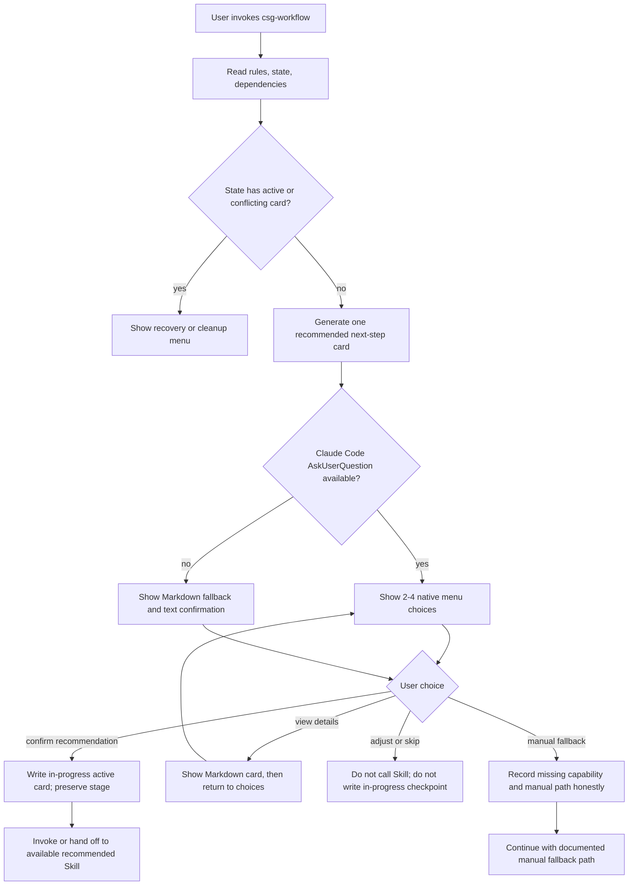

# feat: Add Claude Code interactive card flow

## Summary

Implement Gate 2 by making Claude Code `AskUserQuestion` the primary next-step confirmation experience for `csg-workflow`, while keeping the existing navigator protocol, state-health rules, and Markdown card as fallback. The work updates the Skill guidance, navigator references, card template, README, pressure scenarios, validator checks, and unittest coverage without adding a CLI, installer, package generator, or workflow executor.

---

## Problem Frame

Gate 1 already gives `csg-workflow` a next-step card protocol, lifecycle routing, Skill catalog, and recovery semantics. The gap is that the user still experiences the route mostly as a Markdown card plus `yes/no/skip`, even though Claude Code already provides the desired arrow-key selection and Enter confirmation through `AskUserQuestion`.

The implementation must therefore connect the existing routing protocol to Claude Code's native question UI, not recreate a terminal menu system. It must also preserve the state semantics that make recovery safe: confirmation starts the next phase but does not complete it or advance the lifecycle stage.

---

## Requirements

- R1. Use Claude Code `AskUserQuestion` as the primary interactive menu for next-step selection in Claude Code.
- R2. Keep the menu small: usually 2-4 options, with the recommended action first and clearly marked as recommended.
- R3. Make option labels and descriptions understandable to beginners without requiring prior Skill ecosystem knowledge.
- R4. Keep Markdown next-step card rendering as details or fallback, not the primary Claude Code confirmation experience.
- R5. On recommendation confirmation, update `docs/workflow/state.md` with an active card, current Skill, and resume action while preserving `current_stage`.
- R6. Advance lifecycle stage only after expected output exists, verification is recorded, or the user confirms equivalent completion.
- R7. Preserve enough handoff context for the next Skill or manual fallback: user goal, recommended Skill, expected output, not-now scope, and recovery prompt.
- R8. If the recommended Skill is missing, present a manual fallback and honest missing-capability state rather than installing or pretending the Skill exists.
- R9. If `AskUserQuestion` is unavailable, fall back to Markdown options and text confirmation, explicitly naming it as fallback.
- R10. If state contains an active card or conflict, show recovery/cleanup choices before generating a new unrelated next step.
- R11. Treat repeat confirmation of the same active card as safe resume: no duplicate log event and no stage advancement.
- R12. Do not write an in-progress checkpoint or call the recommended Skill when the user selects skip, adjust, or view details, unless the user explicitly saves a changed card.
- R13. Preserve Gate 1 lifecycle, Skill catalog, router rules, next-step card protocol, and state-health preflight because they are the routing core.
- R14. Demote or remove future CLI / renderer-neutral / `cli_menu` / arrow-key renderer language where it could steer Gate 2 toward custom UI work.
- R15. Keep `state.md` a short current snapshot; do not expand it into a machine database for a future CLI.

**Origin actors:** A1 beginner user, A2 `csg-workflow` Skill, A3 Claude Code, A4 follow-up Skill, A5 later-session AI.
**Origin flows:** F1 interactive next-step menu, F2 user confirms recommended next step, F3 user adjusts/skips/recovers.
**Origin acceptance examples:** AE1, AE2, AE3, AE4, AE5, AE6. When translated into repository pressure scenarios, use AE22-AE27 because AE1-AE21 already exist.

---

## Scope Boundaries

- Do not implement `csg start` or any standalone command.
- Do not build a terminal arrow-key menu, renderer script, or custom CLI UI.
- Do not implement `csg package`, `csg install`, a clean Skill package generator, or global installation flow.
- Do not add npm, pip, binary distribution, PATH setup, or release automation.
- Do not add workflow executor behavior or automatic multi-Skill chains.
- Do not expand the card schema or `state.md` for a hypothetical future independent CLI.
- Do not automatically install missing Compound, Superpowers, or Gstack capabilities.

### Deferred to Follow-Up Work

- Any standalone CLI or non-Claude-Code UI exploration is deferred until there is a distinct user problem not solved by Claude Code's native question tool.
- Real end-to-end UI automation against Claude Code's rendered menu is deferred; this repository should validate the Skill protocol and documented behavior structurally.

---

## Context & Research

### Relevant Code and Patterns

- `SKILL.md` is the Skill entry point and currently stops after emitting a card and asking for confirmation.
- `references/navigator/router-rules.md` defines the exactly-one-default recommendation rule, prompt injection guard, confirmation boundary, and routing flow.
- `references/navigator/next-step-card.md` defines the fenced card schema and canonical examples for lifecycle and recovery cards.
- `references/navigator/workspace-state.md` defines state-health preflight, confirmation semantics, old-state migration, active-card recovery, repeat confirmation, and conflict handling.
- `assets/templates/cards/next-step.md` defines the Markdown display hierarchy and still presents `yes/no/skip` as the visible confirmation shape.
- `references/missing-skills.md` and `references/dependency-setup.md` define missing Skill handling and explicitly avoid automatic installation.
- `tests/pressure-scenarios/csg-workflow-v1.md` already hosts acceptance scenarios AE1-AE21 and should be extended with Gate 2 scenarios.
- `tests/test_csg_workflow_package.py` uses Python `unittest` and text/schema assertions against repository files.
- `scripts/validate_package.py` validates package structure, forbidden public content, state snapshot length, card schema, wrapper delegation, and pressure scenario coverage.
- `README.md` is the user-facing product entry and should describe Claude Code native menu behavior without implying a new CLI.

### Institutional Learnings

- There is no `docs/solutions/` directory with formal learning cards.
- `docs/workflow/log.md` records that the earlier Gate 2 terminal CLI direction was abandoned after user correction.
- `docs/workflow/decisions.md` records the durable decision that Gate 2 is Claude Code interactive card work and not `csg start`, `csg package`, or a custom menu.
- The state-health plan established that `state.md` is a current snapshot, not history, and that confirmation must not be mistaken for completion.

### External References

- None used. The relevant behavior is a Claude Code Skill interaction contract and the local navigator protocol is the source of truth.

---

## Key Technical Decisions

- **Document the `AskUserQuestion` contract in the Skill protocol rather than adding runtime code:** This repository is a Skill package whose behavior is expressed through `SKILL.md`, references, templates, tests, and validators. Gate 2 should make the agent call Claude Code's built-in question tool through instructions, not ship a duplicate menu program.
- **Keep exactly one default recommendation:** `AskUserQuestion` may display a few user choices, but the routing decision still has exactly one recommended Skill. Other choices are recovery, adjustment, details, skip, or fallback paths.
- **Treat Markdown as fallback/details:** Markdown card rendering remains required for portability and auditability, but in Claude Code it should not be framed as the main `yes/no/skip` interaction.
- **Keep unconfirmed menus ephemeral by default:** A displayed `AskUserQuestion` menu should not write an active card by itself. Only confirming the recommended action writes `in_progress`; `proposed` remains a non-started recovery state for existing checkpoints or explicit "save adjusted card for later" choices, not something created by normal menu display.
- **Use the existing `rendering.claude_question` card field:** The existing card schema already includes `rendering.claude_question` for interactive question metadata. Gate 2 should require it for complete canonical cards while still refusing new future-CLI renderer fields.
- **Use the existing short checkpoint state model:** Gate 2 should not add a large required state section. It should adapt old-state detection around the existing `## 执行中检查点` shape and required checkpoint fields.
- **Record manual fallback honestly:** When a recommended Skill is missing, preserve the intended route and record that the user is using a manual fallback, so future recovery does not pretend an unavailable Skill ran.
- **Strengthen structural validation instead of introducing UI automation:** Tests and `validate_package.py` should assert the documented interaction and schema constraints. They should not require automating Claude Code's UI.
- **Reserve `next-step-card` fences for complete canonical cards:** Interaction examples that are not full card schema examples should use non-card fences so the validator only parses complete canonical card blocks.
- **Demote future CLI wording without deleting the routing core:** Gate 1's lifecycle, catalog, router, cards, and state-health rules remain useful. Only wording that frames future CLI/renderers as current design drivers should be removed or lowered.

---

## Open Questions

### Resolved During Planning

- Should Gate 2 implement a terminal UI because the user wants arrow-key selection? No. The user explicitly wants Claude Code's native `AskUserQuestion` experience.
- Should menu confirmation advance the project stage? No. Confirmation only starts or resumes the next phase. Stage advancement requires expected output, verification, or equivalent user-confirmed completion.
- Should this plan add end-to-end tests for the rendered Claude Code menu? No. The repository can only reliably validate instructions, templates, examples, and schema; real UI rendering remains a platform behavior.

### Deferred to Implementation

- Exact final wording of menu labels and descriptions can be tuned while editing the docs, but the implementation should start from the canonical option sets in this plan and keep the same option order/semantics.
- Exact state text for manual fallback can be adjusted during implementation, as long as it preserves the intended Skill route, records missing capability honestly, and keeps `state.md` short.
- Exact internal field names for active card storage can be adjusted during implementation, but the state model must use the existing short checkpoint shape rather than adding a larger required state section.

---

## High-Level Technical Design

> *This illustrates the intended approach and is directional guidance for review, not implementation specification. The implementing agent should treat it as context, not code to reproduce.*

---

## Implementation Units

### U1. Define the Claude Code interaction contract

**Goal:** Make `AskUserQuestion` the documented primary confirmation path for next-step cards in Claude Code.

**Requirements:** R1, R2, R3, R4, R7, R9, AE1

**Dependencies:** None

**Files:**
- Modify: `SKILL.md`
- Modify: `references/navigator/router-rules.md`
- Modify: `references/navigator/next-step-card.md`
- Modify: `assets/templates/cards/next-step.md`
- Test: `tests/test_csg_workflow_package.py`

**Approach:**
- Update the route completion step in `SKILL.md` so Claude Code asks through `AskUserQuestion` when available and uses Markdown/text confirmation only as fallback.
- Add a concise `AskUserQuestion` menu contract to navigator docs: recommended action first, 2-4 options, short labels, beginner-readable descriptions, and no requirement that the user already knows Skill names.
- Define canonical option sets as protocol examples:
  - Normal recommendation: recommended action, view details, adjust route, skip for now.
  - Missing Skill: manual fallback for the recommended route, view missing-skill details, adjust route, stop for now.
  - Recovery: choices depend on `proposed`, `in_progress`, or conflict state, with destructive cleanup clearly labeled.
- Define view-details as a loop: it shows the Markdown card without writing state, then returns to the same confirmation choices.
- Define fallback formatting: when native questions are unavailable, render the same option set as numbered Markdown/text choices and explicitly state that this is fallback.
- Reframe the Markdown card template as display details and fallback rather than the primary Claude Code confirmation UI.
- Keep the fenced `next-step-card` data schema stable by reusing the existing `rendering.claude_question` field and not adding future CLI renderer fields.

**Patterns to follow:**
- Existing confirmation boundary in `references/navigator/router-rules.md`.
- Existing card field requirements and canonical examples in `references/navigator/next-step-card.md`.
- Existing short-entry style in `SKILL.md`.

**Test scenarios:**
- Covers AE1. Happy path: a healthy requirements-stage route documents `AskUserQuestion` as the primary Claude Code menu, with the recommended action first and 2-4 options.
- Happy path: canonical normal menu includes recommended action, view details, adjust route, and skip-for-now choices in that order.
- Edge case: selecting view details shows Markdown details and returns to the same confirmation choices without state changes.
- Edge case: Markdown rendering remains required but is described as fallback/details, not the main Claude Code confirmation path.
- Error path: when `AskUserQuestion` is unavailable, the documented fallback explicitly says Markdown/text confirmation is being used as fallback and preserves the same choices.
- Regression: no `cli_menu`, `csg start`, or custom terminal menu requirement is introduced in navigator docs or card template.

**Verification:**
- `SKILL.md`, `router-rules.md`, `next-step-card.md`, and `assets/templates/cards/next-step.md` consistently name `AskUserQuestion` as the Claude Code primary interaction.
- Tests fail if the template still presents `yes/no/skip` as the primary Claude Code experience.

---

### U2. Specify confirmation, recovery, and adjustment state semantics

**Goal:** Preserve safe routing state when users confirm, view details, adjust, skip, repeat confirmation, or recover an existing card.

**Requirements:** R5, R6, R10, R11, R12, R15, AE2, AE4, AE5

**Dependencies:** U1

**Files:**
- Modify: `references/navigator/workspace-state.md`
- Modify: `references/navigator/router-rules.md`
- Modify: `assets/templates/workflow/state.md`
- Modify: `examples/minimal-project/docs/workflow/state.md`
- Test: `tests/test_csg_workflow_package.py`

**Approach:**
- Add a Gate 2 state transition table that supplements the existing workspace-state status enum rather than replacing it.
- Keep unconfirmed menus ephemeral by default: showing `AskUserQuestion` does not write an active card or checkpoint.
- Treat existing `proposed` state as compatibility/recovery input only: re-show the pending confirmation without assuming work started.
- Define confirmation of the recommended action as the only normal path that writes an `in_progress` active card.
- Define view-details as read-only: show the Markdown card, return to the same choices, and do not change state.
- Define adjust route as a second blocking choice that stays inside `csg-workflow`: ask whether the user wants to change the goal, choose a different known lifecycle stage, or stop and provide free-text direction. After adjustment, generate one revised card and ask for confirmation again. Only an explicit "save this adjusted card for later" choice may write `proposed`; it must not call the recommended Skill or write `in_progress`.
- Define skip as a terminal non-executing choice: do not call the recommended Skill, do not write a checkpoint, and leave the existing state unchanged except for any user-approved cleanup.
- Distinguish recovery menus:
  - `proposed`: continue confirming this recommendation, view details, adjust route, or stop for now.
  - `in_progress`: resume the recorded task, view the recorded card, clear the checkpoint, or choose another route.
  - conflict/`recovery_needed`: view conflict summary, keep and resume checkpoint, clear checkpoint and re-route, or stop for manual handling.
- Require clear confirmation wording before clearing a checkpoint: clearing removes only the active checkpoint, does not delete log history, and does not advance stage.
- Preserve the existing short checkpoint shape and old-state detection around `## 执行中检查点` fields instead of requiring a new large `## 下一步卡片` section.
- Preserve the existing state file length constraint and avoid adding historical detail to state templates.

**Patterns to follow:**
- `references/navigator/workspace-state.md` confirmation semantics and recovery-mode cases.
- Existing state template headings and 60-line validation in `scripts/validate_package.py`.

**Test scenarios:**
- Covers AE2. Happy path: confirming the recommended requirements-to-plan card records `status: in_progress`, `active_card`, `current_skill`, and `resume_action` while preserving `current_stage: requirements`.
- Covers AE4. Edge case: an existing `status: proposed` checkpoint is handled as compatibility recovery, re-shows the pending confirmation, and does not treat the work as started.
- Covers AE4. Edge case: `status: in_progress` with an active card defaults to resume/clear choices and does not generate a new unrelated next-step card.
- Covers AE4. Repeat confirmation: the same active card is re-shown or resumed without duplicate log events and without stage advancement.
- Covers AE5. Adjustment path: selecting adjust opens an in-Skill adjustment choice, can regenerate one revised card, and still does not invoke the recommended Skill or write an in-progress checkpoint before explicit confirmation.
- Covers AE5. Skip path: selecting skip stops without invoking the recommended Skill, writing a checkpoint, or advancing stage.
- Edge case: choosing view details renders the Markdown card, returns to confirmation choices, and leaves state unchanged.
- Regression: old-state detection accepts the existing short checkpoint shape and does not require a new large `## 下一步卡片` section.

**Verification:**
- `workspace-state.md` explicitly covers proposed recovery, in-progress recovery, repeat confirmation, skip/adjust, and details-only behavior.
- State templates remain within the 60-line limit.
- Tests assert that confirmation does not advance lifecycle stage.

---

### U3. Define missing Skill and unavailable question fallbacks

**Goal:** Make fallback behavior safe and honest when either the recommended Skill or the Claude Code question tool is unavailable.

**Requirements:** R8, R9, R12, AE3

**Dependencies:** U1, U2

**Files:**
- Modify: `references/missing-skills.md`
- Modify: `references/dependency-setup.md`
- Modify: `references/navigator/skill-catalog.md`
- Modify: `references/navigator/router-rules.md`
- Modify: `references/navigator/workspace-state.md`
- Test: `tests/test_csg_workflow_package.py`

**Approach:**
- Clarify that dependency checks happen before menu construction when dependency state is absent or stale.
- Define missing Skill menu behavior: explain the missing capability, keep the stable role, and offer a manual fallback without installing anything.
- Define state recording for manual fallback: preserve the intended route and record that execution is manual or fallback-based.
- Define the fallback text format: state why native menu is unavailable, say the numbered choices are equivalent to the native menu, and explain that only choosing the recommended/manual route writes `in_progress`.
- Define `AskUserQuestion` unavailable behavior: render the same choice set in Markdown/text form, explicitly naming it as fallback and preserving the same confirmation boundary.
- Keep installation guidance as user-confirmed external setup documentation, not as Gate 2 installer behavior.

**Patterns to follow:**
- Missing Skill constraints in `references/missing-skills.md`.
- Availability discovery boundaries in `references/navigator/skill-catalog.md`.
- Dependency check order in `SKILL.md` and `references/navigator/router-rules.md`.

**Test scenarios:**
- Covers AE3. Error path: when the recommended Compound Skill is missing, the menu offers a manual fallback and does not auto-install or pretend the Skill exists.
- Error path: confirming manual fallback records missing capability and manual path honestly enough for later recovery.
- Error path: when `AskUserQuestion` is unavailable, Markdown fallback keeps the same recommendation and clearly labels itself as fallback.
- Regression: dependency setup docs still require user confirmation for installs and are not described as a built-in installer.

**Verification:**
- Missing Skill docs, router rules, and workspace-state agree on fallback semantics.
- Tests assert that auto-install claims and fake Skill execution remain forbidden.

---

### U4. Simplify Gate 1 future-CLI wording without weakening navigator core

**Goal:** Remove or demote wording that makes future standalone CLI/renderers look like Gate 2 implementation prerequisites.

**Requirements:** R13, R14, R15, AE6

**Dependencies:** U1

**Files:**
- Modify: `references/navigator/next-step-card.md`
- Modify: `assets/templates/cards/next-step.md`
- Modify: `SKILL.md`
- Test: `tests/test_csg_workflow_package.py`

**Approach:**
- Keep the lifecycle enum, Skill catalog, router rules, card examples, and state-health preflight intact.
- Replace renderer-neutral phrasing that implies future renderer work is near-term with language that says Markdown is portable fallback and `AskUserQuestion` is the Claude Code primary interaction.
- Remove `cli_menu` and standalone arrow-key renderer references from current implementation guidance.
- Leave README and workflow decision/log alignment to U6 so user-facing documentation has one owner after protocol wording is settled.

**Patterns to follow:**
- Current V1 boundary in `SKILL.md` and `README.md` that already excludes CLI, installer, arrow-key menu, and workflow executor.
- Durable Gate 2 decisions in `docs/workflow/decisions.md`.

**Test scenarios:**
- Covers AE6. Regression: navigator docs do not require or prepare `cli_menu` fields.
- Covers AE6. Regression: future CLI / arrow-key renderer wording is not presented as a Gate 2 prerequisite.
- Regression: Gate 1 routing core terms remain present after simplification.

**Verification:**
- Navigator docs no longer steer Gate 2 toward custom CLI/menu work.
- Tests assert both the removed/demoted CLI wording and the preserved navigator core terms.

---

### U5. Add Gate 2 pressure scenarios and validator coverage

**Goal:** Make the corrected Gate 2 behavior hard to regress through acceptance scenarios and package validation.

**Requirements:** R1, R2, R5, R8, R9, R10, R11, R12, R14, AE1, AE2, AE3, AE4, AE5, AE6

**Dependencies:** U1, U2, U3, U4

**Files:**
- Modify: `tests/pressure-scenarios/csg-workflow-v1.md`
- Modify: `tests/test_csg_workflow_package.py`
- Modify: `scripts/validate_package.py`

**Approach:**
- Add six Gate 2 acceptance examples after the existing Gate 1 navigator scenarios, numbered AE22-AE27 to avoid colliding with existing AE1-AE21.
- Map origin examples to repository pressure scenarios: AE22 covers origin AE1, AE23 covers origin AE2, AE24 covers origin AE3, AE25 covers origin AE4, AE26 covers origin AE5, and AE27 covers origin AE6.
- Cover normal `AskUserQuestion` menu, confirm-without-stage-advance, compatibility handling for existing proposed state, in-progress recovery, repeat confirmation, skip/adjust, missing Skill fallback, unavailable question fallback, and Gate 1 CLI wording simplification.
- Update validator pressure scenario range from `range(1, 22)` to `range(1, 28)` so missing new Gate 2 scenarios fail validation.
- Strengthen card validation so every complete canonical card includes both `rendering.markdown` and the existing `rendering.claude_question`; Markdown fallback examples do not define a separate card schema.
- Require only complete canonical cards to use the `next-step-card` fence. Menu examples or fallback snippets should use non-card fences such as text/markdown so the card parser does not treat them as schema examples.
- Add unittest cases that intentionally break the new expectations in temporary copies and assert validation catches them.

**Patterns to follow:**
- Existing AE16-AE21 pressure scenario style in `tests/pressure-scenarios/csg-workflow-v1.md`.
- Existing temporary-copy negative tests in `tests/test_csg_workflow_package.py`.
- Existing `validate_cards()` schema validation style in `scripts/validate_package.py`.

**Test scenarios:**
- Covers AE22 / origin AE1. Happy path: pressure scenario requires Claude Code native menu as primary and Markdown as fallback/details.
- Covers AE23 / origin AE2. Happy path: confirmation writes an in-progress active card while preserving current stage.
- Covers AE24 / origin AE3. Error path: missing recommended Skill shows manual fallback and forbids auto-install/fake execution.
- Covers AE25 / origin AE4. Edge case: existing proposed and in-progress active cards route to the correct recovery menus before new routing.
- Covers AE26 / origin AE5. Edge case: skip/adjust/detail choices do not call the recommended Skill and do not write in-progress checkpoints.
- Covers AE27 / origin AE6. Regression: future CLI wording and `cli_menu` schema expansion are rejected or explicitly out of current scope.
- Error path: a complete canonical card missing `rendering.claude_question` fails validation when the docs require it.
- Edge case: fallback/menu examples that are not full cards do not use the `next-step-card` fence and are not parsed as canonical cards.

**Verification:**
- `scripts/validate_package.py` fails if the new Gate 2 pressure scenarios are missing.
- `tests/test_csg_workflow_package.py` includes positive and negative assertions for the new Gate 2 behavior.
- Package validation and unittest suite pass after implementation.

---

### U6. Update user-facing documentation and workflow handoff state

**Goal:** Make the public README and workflow handoff files reflect the corrected Gate 2 direction after implementation.

**Requirements:** R1, R4, R7, R13, R14, R15

**Dependencies:** U1, U2, U3, U4, U5

**Files:**
- Modify: `README.md`
- Modify: `docs/workflow/state.md`
- Modify: `docs/workflow/log.md`
- Modify: `docs/workflow/decisions.md`
- Test: `scripts/validate_package.py`
- Test: `tests/test_csg_workflow_package.py`

**Approach:**
- Update README's first-screen product explanation to mention Claude Code native selection as the primary Gate 2 experience while preserving Codex/Markdown compatibility.
- Keep README's boundary clear: no CLI, no installer, no custom terminal menu, no workflow executor.
- After implementation, collapse `docs/workflow/state.md` into the next accurate snapshot and avoid long history.
- Append concise historical details to `docs/workflow/log.md` and durable decisions to `docs/workflow/decisions.md` only when implementation actually changes the durable decision record.
- Preserve the existing `.gitignore` change if it remains unrelated and do not overwrite unrelated working tree state.

**Patterns to follow:**
- README's current concise Chinese/English mix and first-version boundary section.
- Existing workflow file roles: current state in `state.md`, durable decisions in `decisions.md`, long history in `log.md`.

**Test scenarios:**
- Happy path: README describes one next-step card plus Claude Code native confirmation without implying a standalone command.
- Edge case: live `docs/workflow/state.md` remains under 60 lines and contains required headings.
- Regression: public docs contain no local absolute paths, TODO/TBD markers, or old Terminal Skill GPS direction.

**Verification:**
- README, workflow state, decisions, and log all point to the AskUserQuestion Gate 2 direction.
- `scripts/validate_package.py` and `python3 -m unittest tests/test_csg_workflow_package.py` pass after implementation.

---

## System-Wide Impact

- **Interaction graph:** The main affected entry points are `SKILL.md`, navigator references, card template, README, and tests. No application runtime or external service integration is introduced.
- **Error propagation:** Missing `AskUserQuestion` or missing recommended Skill should degrade into explicit fallback text, not silent failure, fake execution, or auto-install behavior.
- **State lifecycle risks:** The main risk is confusing menu display, confirmation, and completion. The plan mitigates this by separating `proposed`, `in_progress`, and recovery states and by asserting no stage advance on confirmation.
- **API surface parity:** Claude Code gets native `AskUserQuestion`; Codex and other environments retain Markdown fallback. The underlying card schema and lifecycle routing remain shared.
- **Integration coverage:** Structural tests and pressure scenarios should prove the documented cross-file protocol is coherent: router rules, card template, workspace state, missing Skill fallback, README, and validator must agree.
- **Unchanged invariants:** The Skill still recommends exactly one default next Skill, stops before routing into another Skill, keeps state short, does not auto-install dependencies, and does not execute multi-Skill chains.

---

## Risks & Dependencies

| Risk | Mitigation |
|------|------------|
| The implementation only changes wording but leaves Markdown `yes/no/skip` as the practical primary path. | U1 and U5 require explicit `AskUserQuestion` primary-contract text and tests that reject Markdown as the Claude Code primary experience. |
| Confirmation is accidentally treated as phase completion. | U2 requires state transition rules and tests that preserve `current_stage` until expected output or verification exists. |
| Recovery becomes unsafe for `proposed` cards. | U2 explicitly distinguishes proposed recovery from in-progress recovery. |
| Missing Skill fallback hides the missing dependency. | U3 requires honest missing-capability state and tests forbidding fake Skill execution or auto-install. |
| Gate 1 simplification removes useful routing protocol. | U4 preserves lifecycle, catalog, router rules, card examples, and state-health preflight while only demoting future CLI wording. |
| Validator changes become too broad or brittle. | U5 limits validation to existing schema/text patterns and avoids UI automation or complex YAML parsing. |
| Public docs accidentally include local paths or unfinished markers. | Existing package validation continues to scan public Markdown, YAML, and Python files. |

---

## Documentation / Operational Notes

- Update README only after the protocol docs are aligned so user-facing claims match implementation guidance.
- Keep rule-block templates short; they can mention native confirmation/fallback but should not embed the full Gate 2 protocol.
- Do not commit or push as part of implementation unless the user explicitly asks.
- Implementation should finish with `python3 scripts/validate_package.py` and `python3 -m unittest tests/test_csg_workflow_package.py`.

---

## Sources & References

- **Origin document:** [docs/brainstorms/2026-05-08-gate-2-claude-code-interactive-card-requirements.md](../brainstorms/2026-05-08-gate-2-claude-code-interactive-card-requirements.md)
- Related code: `SKILL.md`
- Related code: `references/navigator/router-rules.md`
- Related code: `references/navigator/next-step-card.md`
- Related code: `references/navigator/workspace-state.md`
- Related code: `assets/templates/cards/next-step.md`
- Related code: `references/missing-skills.md`
- Related code: `references/navigator/skill-catalog.md`
- Related code: `scripts/validate_package.py`
- Related code: `tests/test_csg_workflow_package.py`
- Related code: `tests/pressure-scenarios/csg-workflow-v1.md`
